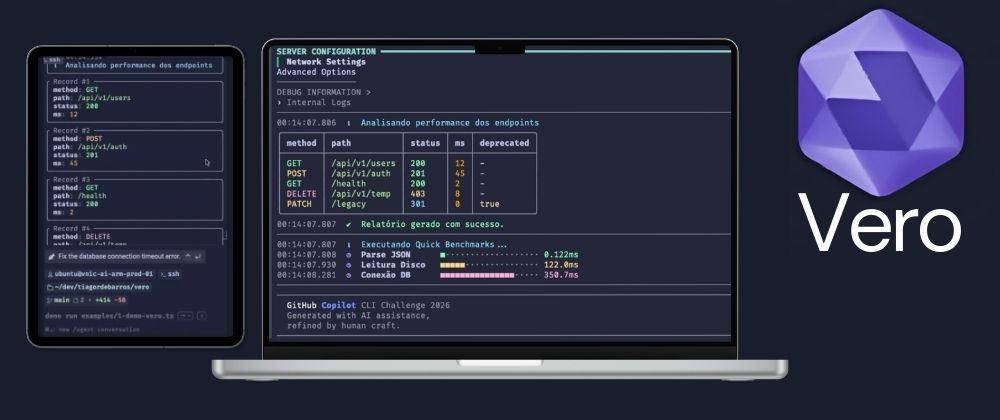
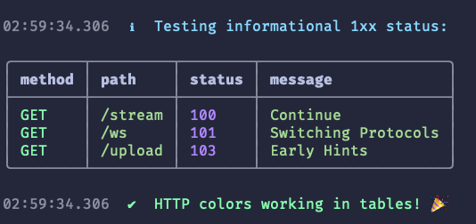
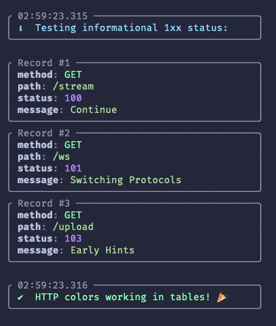
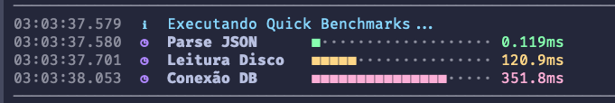
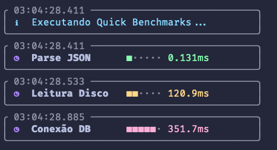

# 🔮 Vero — _See the Truth in Your Code_

<div align="center">


</div>

---

> **A zero-dependency, isomorphic visual logger that makes `console.log`
> actually beautiful.**\
> Built for developers who care deeply about Developer Experience (DX).

---

## 🎥 Video Demo

<div align="center">

[](https://www.youtube.com/watch?v=r9H7T-_UTZI)

</div>

---

## ⚡ Why Vero Exists

Let’s be honest.

`console.log()` is functional — but not expressive.

- Walls of unformatted objects
- `[Object object]` noise
- No circular reference handling
- Manual performance timing
- Tables that collapse in narrow terminals

**Vero fixes that — without breaking the console.**

It is **not** a production logger.\
Use Pino or Winston for structured production logging.

Vero is a **visual debugger for development**.

---

## 🎯 Core Principles

- 🛡 **Zero Dependencies**
- 🌐 **Isomorphic by Design**
- 🔌 **Does NOT override `globalThis.console`**
- 🎨 **Type-aware color formatting**
- 📐 **Responsive ASCII tables**
- ⏱ **Visual performance timers**
- 🧠 **Runtime-agnostic (Web Standards only)**

---

## 📸 Preview



---

## 🚀 Installation

```bash
# Deno
deno add @tiagordebarros/vero

# Node
npx jsr add @tiagordebarros/vero

# Bun
bunx jsr add @tiagordebarros/vero
```

---

## 🧪 Quick Start

```ts
import { logger } from "@tiagordebarros/vero";

logger.info("Hello world");
logger.success("It works!");
```

---

## 🎨 Smart Object Formatting

```ts
const user = {
  id: 1,
  name: "Alice",
  roles: ["admin", "editor"],
  meta: { active: true },
};

logger.info(user);
```


✔ Circular-safe\
✔ Depth-limited\
✔ Type-aware coloring\
✔ Clean nested visualization

---

## 📐 Responsive Tables

```ts
logger.table([
  { endpoint: "/api/v1", latency: "12ms", status: 200 },
  { endpoint: "/api/auth", latency: "450ms", status: 500 },
]);
```




- Two-pass column width calculation
- Unicode box drawing
- Auto card-view fallback on narrow terminals
- Layout adapts to terminal width

---

## ⏱ Visual Performance Timing

```ts
logger.time("DatabaseQuery");
await db.query("SELECT * FROM users");
logger.timeEnd("DatabaseQuery");
```

Example output:

```
⏱ DatabaseQuery    ■■■■■····    42.3ms
```

Color-coded thresholds:

- 🟢 < 50ms
- 🟡 < 200ms
- 🔴 > 200ms




---

## 🌐 Runtime Support

Vero works identically across:

- 🦕 Deno
- 🟢 Node.js
- 🥟 Bun
- 🌐 Browsers

No runtime hacks.\
No conditional builds.\
Only Web Standards.

---

## 🏗 Architecture

The project follows a layered architecture:

- `constants/` → visual & theme primitives
- `core/` → logger engine & configuration
- `formatting/` → ANSI, layout & object formatting
- `performance/` → benchmarking & timing utilities
- `utils/` → environment & terminal helpers
- `types/` → public type definitions
- `mod.ts` → public entrypoint

For full technical details, see:

➡ **ARCHITECTURE.md**

---

## 📚 Documentation

- CONTRIBUTING.md
- SECURITY.md
- SUPPORT.md
- ARCHITECTURE.md

---

## 🛡 Stability Guarantees

Vero guarantees:

- No console override
- No runtime coupling
- No external dependencies
- Stable public API
- Deterministic formatting behavior

---

## 🗺 Roadmap

- [ ] Plugin system
- [ ] Theme system
- [ ] Extended browser styling
- [ ] Terminal charts
- [ ] Coverage automation

---

## 🤝 Contributing

Before submitting a PR, read **CONTRIBUTING.md**.

Architectural rules are strict:

- Zero Dependencies
- Isomorphic only
- No console override
- No runtime-specific branches

This is intentional.

---

## 💖 Support

If Vero improves your DX, consider sponsoring development.

See **FUNDING.yml** for available options.

---

## 📜 License

MIT © 2026\
Tiago Ribeiro de Barros\
ORCID: https://orcid.org/0000-0001-6823-3562

---

## 🌟 Why “Vero”?

From Latin _verus_ — truth.

**See the truth in your code.**

---

<div align="center">

⭐ Star this repository if Vero made your terminal beautiful.

</div>
